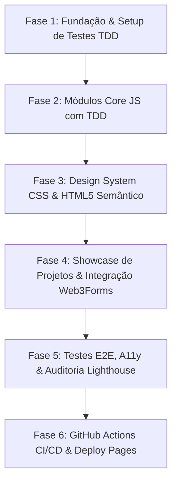

# 🗺️ ROADMAP.md: Portfólio Profissional no GitHub Pages

Este roadmap define as fases de execução orientadas a TDD-First (Akita Way) e entregas atômicas verificáveis.

---

## 📌 Visão Geral das Fases

---

## 🚀 Detalhamento das Fases

### 🔹 Fase 1: Fundação & Setup de Testes TDD
- **Objetivo:** Estabelecer o ambiente de desenvolvimento, configurar ferramentas de teste (Vitest, JSDOM, Playwright) e a estrutura de pastas do projeto.
- **Entregáveis:**
  - `package.json` com scripts de teste e linting.
  - `vitest.config.js` e `playwright.config.js`.
  - Estrutura base de pastas (`assets/css`, `assets/js`, `assets/img`, `tests/unit`, `tests/e2e`).
  - Primeiro teste de sanidade executado e passando.
- **Validação:** `npm run test` executando com sucesso.

---

### 🔹 Fase 2: Módulos Core JS com TDD (Red-Green-Refactor)
- **Objetivo:** Desenvolver a lógica central do portfólio seguindo rigorosamente o ciclo TDD (escrever testes unitários antes do código).
- **Entregáveis:**
  - `tests/unit/theme.test.js` -> `assets/js/theme.js` (detecção de sistema, toggle, persistência `localStorage`).
  - `tests/unit/i18n.test.js` -> `assets/js/i18n.js` (dicionários PT-BR/EN/ES, substituição no DOM, fallback).
  - `tests/unit/projects.test.js` -> `assets/js/projects.js` (filtragem dinâmica por categorias/tags).
  - `tests/unit/contact.test.js` -> `assets/js/contact.js` (validação e envio assíncrono para Web3Forms com fallback).
- **Validação:** `npm run test` com 100% de cobertura nos módulos JS.

---

### 🔹 Fase 3: Design System CSS & HTML5 Semântico
- **Objetivo:** Construir a base visual responsiva, variáveis de tema (dark/light), layout semântico e acessibilidade.
- **Entregáveis:**
  - `assets/css/style.css` (CSS variables, tokens de cores, tipografia, grid/flexbox, botões, responsividade).
  - `index.html` (estrutura semântica completa com `header`, `main`, `section`, `footer`, metatags Open Graph e Twitter Cards).
  - Controles acessíveis de alternância de tema e seletor de idiomas.
- **Validação:** Renderização visual e responsividade verificadas em diferentes resoluções.

---

### 🔹 Fase 4: Showcase de Projetos, Conteúdo & Formulário de Contato
- **Objetivo:** Integrar os conteúdos reais de Mailson Maia Alves e conectar a interface aos módulos JS.
- **Entregáveis:**
  - Hero Section com apresentação de impacto e botões de ação rápida.
  - Seção Sobre Mim & Metodologia (TDD, Akita Way, Clean Architecture).
  - Matriz de Especialidades (Backend/ERP, Frontend, DevOps, Game Dev).
  - Cards de Projetos Dinâmicos: *Aviso de Cópia*, *Módulos Odoo 19*, *Automações n8n*, *PHP Apps*, *Godot Games*.
  - Seção de Serviços e Consultoria.
  - Formulário de Contato assíncrono com Web3Forms + Botões diretos (WhatsApp, LinkedIn, Email).
- **Validação:** Testes unitários atualizados e fluxo de interface funcional.

---

### 🔹 Fase 5: Testes E2E, Acessibilidade & Auditoria Lighthouse
- **Objetivo:** Garantir que o portfólio funcione perfeitamente de ponta a ponta e atinja nota 100 no Lighthouse.
- **Entregáveis:**
  - Testes E2E com Playwright (`tests/e2e/portfolio.spec.js`) cobrindo:
    - Alternância de tema (Dark/Light) com persistência.
    - Troca de idioma (PT-BR, EN, ES) com persistência.
    - Filtro de projetos por categoria.
    - Envio do formulário de contato.
  - Auditoria de acessibilidade (A11y) e auditoria de performance/Lighthouse.
- **Validação:** `npx playwright test` passando com 100% de sucesso.

---

### 🔹 Fase 6: GitHub Actions CI/CD & Deploy no GitHub Pages
- **Objetivo:** Configurar automação de integração contínua e deploy automático no GitHub Pages.
- **Entregáveis:**
  - `.github/workflows/ci.yml` (execução automática de testes unitários e linter em pushes e PRs).
  - `.github/workflows/deploy.yml` (deploy para GitHub Pages).
  - `README.md` trilíngue (PT-BR, EN, ES) documentando o portfólio e instruções.
  - Repositório remoto configurado para `mailsonm/mailsonm.github.io`.
- **Validação:** Pipeline de CI passando e site ativo em `https://mailsonm.github.io/`.
